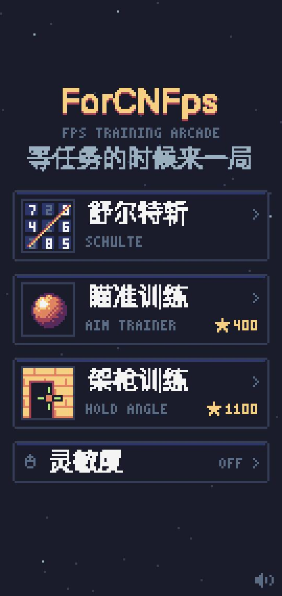
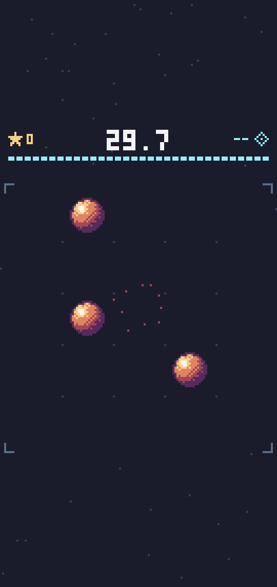
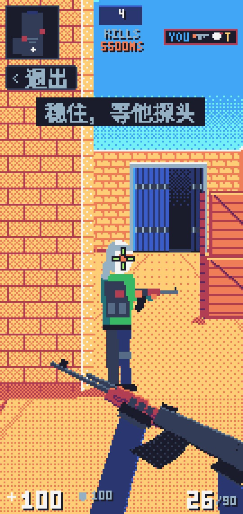
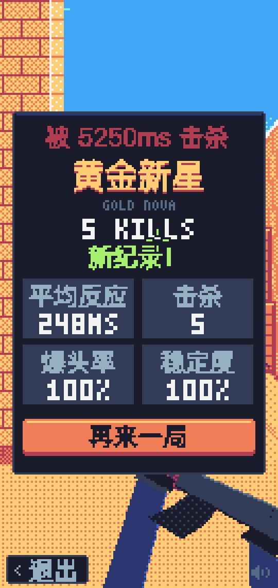
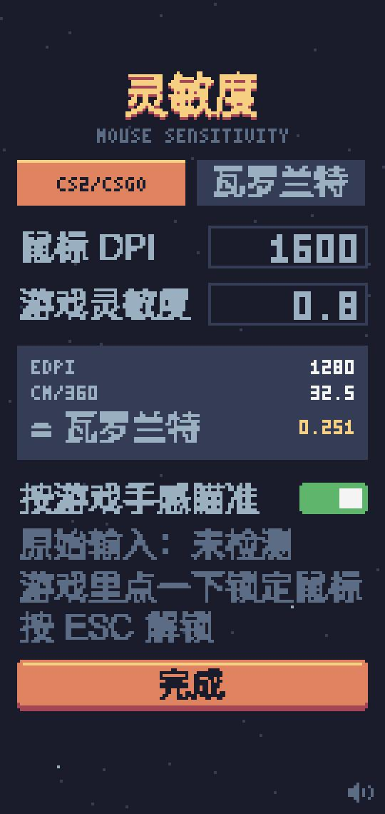

# ForCNFps

**DeepSeek Harness 插件：等智能体干活的时候，在右侧栏练练枪。**

一个像素风的 FPS 练手小游戏合集，装好后出现在 [DeepSeek Harness](https://github.com/deepseek-ai/deepseek-harness)（dsh）右侧栏。任务在跑时顶部会提示「智能体干活中」，跑完提示「任务完成了」，玩两局刚好等到结果。

| 选单 | 瞄准训练 | 架枪训练 | 结算 | 灵敏度 |
|:-:|:-:|:-:|:-:|:-:|
|  |  |  |  |  |

## 创作动机

CN FPS 的惨状大家有目共睹：瓦罗兰特上海冠军赛，CN 队伍一胜难求；CN CS 的处境，甚至还不如 CN 瓦。

为了 CN FPS 的崛起，我把目光投向了一群人——程序员。他们是每天坐在电脑前时间最长的人，鼠标就在手边，而且现在多了大把「等模型回复」的空档：看着智能体思考、跑命令、改代码，干等着也是等着。

于是有了 ForCNFps：在 DeepSeek Harness 的右侧栏里，用这些无聊的碎片时间磨练准星、反应和架枪的基本功。也许有朝一日，真能为 CN FPS 作出一点贡献。

## 三个游戏

- **舒尔特斩**：舒尔特方格做成的动作游戏，按 1→N 的顺序点敌兵，火柴人冲过去斩杀，连斩越高招式越帅。练注意力和视觉搜索。
- **瞄准训练**：仿 Aim Lab 的 Gridshot。5×5 格子里同时亮 3 个小球，点掉一个补一个，30 秒一局，越快分越高，连击时音调沿五声音阶往上走。
- **架枪训练**：像素风 CS 第一人称，Dust2 A 大道。准星固定在屏幕中心、动鼠标转视角，右下角是 AK 持枪（后坐、枪口火焰、抛壳），HUD 有雷达、击杀播报、血量护甲和弹药。每回合先把准星对准白圈稳住，随机等待后敌人从远处门缝 / 中距离木箱 / 近处石柱探头——**露头后在「敌人反应时间」内没打死他，他就打死你，游戏结束**。敌人反应时间从 650ms 起、每杀一个快 25ms、最快 300ms（职业选手水平）；提前开枪会暴露位置，他会预瞄着更快拉出来；连续开枪散布变大，打空要换弹（R 键手动换）。结算看击杀数给段位（白银 → 全球精英），外加平均反应、爆头率、稳定度。

三个游戏里都有「‹ 退出」按钮，也可以按 ESC 回到选单（鼠标锁定时第一下 ESC 是解锁，再按一下退出）。

## 灵敏度换算

选单底部「灵敏度」里填鼠标 DPI 和你在 **CS2/CSGO** 或 **瓦罗兰特** 里的灵敏度：

- 显示 **eDPI**、**cm/360**（游戏里转一圈鼠标要移动多少厘米），以及另一款游戏的等效灵敏度（例如 CS2 1.2 ≈ 瓦罗兰特 0.377）。
- 打开「按游戏手感瞄准」后，瞄准训练和架枪训练里点一下会锁定鼠标（Pointer Lock），每个鼠标计数按游戏公式转动（CS：灵敏度 × 0.022°，瓦罗兰特：灵敏度 × 0.07°），换算假设游戏全屏铺满你这块显示器（CS2 16:9 视野 106.26°、4:3 拉伸 90°，瓦罗兰特 103°），侧栏就是显示器上的一扇小窗：鼠标移动同样距离，准星在屏幕上走过的物理距离和游戏里一样。按 ESC 解锁。
- 会优先请求不经过系统指针加速的「原始输入」；设置页会显示是否拿到了。拿不到时手感只能参考；锁定被拒绝时自动退回跟随系统光标。

## 线上排行榜

选单里点「排行榜」可以看三个游戏的全球榜（每人每个游戏只留最好的一条），点「上传我的最佳」会打开一个填好成绩的 GitHub 新建 Issue 页面，用你的 GitHub 账号点 **Submit new issue** 就行。仓库里的 GitHub Actions 机器人会审核成绩、更新 [leaderboard.json](leaderboard.json)，然后回复名次并关闭 Issue，大约 1 分钟后插件里就能看到。

- **架枪训练**：先比击杀再比分。上传每个击杀的反应时间和敌人反应时间，机器人检查反应在 100ms 以上、敌人反应时间符合 650 → 300ms 的规律，并按明细重算分数。
- **瞄准训练**：比分数。上传每一次点击（命中的反应时间 / 空枪），机器人按规则重放一遍算分。
- **舒尔特斩**：比 5×5 方阵的最快用时。它本地没有每一刀的明细，只检查数值是否合理。

游戏完全跑在浏览器里，校验只能挡住随手改数字，挡不住专门研究代码的人；每条成绩都挂着 GitHub 账号、提交记录公开可查，发现作弊会直接删榜。审核逻辑在 [scripts/leaderboard.mjs](scripts/leaderboard.mjs)。

## 安装

需要 Node.js（`npx` 会自动下载 dsh）。

**网页版 / 命令行**：

```bash
npx @deepseek-ai/dsh plugin --profile web add github:mixx993/dsh-forcnfps
```

装好后重新启动 `npx @deepseek-ai/dsh web`，打开对话右侧栏，在开始页点「ForCNFps」。

**桌面版**：桌面版用自己的配置，要先 **完全退出**（macOS 按 ⌘Q），再用桌面版自带的命令安装：

```bash
"/Applications/DeepSeek Harness.app/Contents/Resources/runtime/cli/bin/dsh" plugin --profile desktop add github:mixx993/dsh-forcnfps
```

如果你已经在桌面版设置里装了 `dsh` 命令，直接 `dsh plugin --profile desktop add github:mixx993/dsh-forcnfps` 也行。然后重新打开桌面版。

**卸载**：把上面命令里的 `add github:mixx993/dsh-forcnfps` 换成 `remove dsh-forcnfps`。

已在 macOS 上验证：dsh 网页版 0.1.5-rc.3、桌面版 0.2.0-rc.2。dsh 还在开发者预览期，接口可能变动，遇到装不上或白屏请提 issue。

## 开发

不需要安装依赖，只用到 Node 自带的模块。

```bash
git clone https://github.com/mixx993/dsh-forcnfps.git
cd dsh-forcnfps
python3 -m http.server 4321 --directory games   # 浏览器打开 http://localhost:4321/hub.html，窗口拉窄到 270 宽左右就是侧栏的样子
npm run build                                    # 改完后打包出 client.js
npx @deepseek-ai/dsh plugin --profile web add link:$(pwd)   # 用本地目录安装，之后每次 build 完重启 dsh 即可
```

架枪训练地址加 `?slow` 时敌人反应时间 ×10，并暴露 `window.__hold()` 方便调试。

```
package.json        dsh 字段声明这是个带网页端的插件；exports["./client"] 指向 client.js
cordis.patch.yml    往 dsh 配置里插一行，按包名加载本插件
index.js            服务端一半（空的，游戏全在浏览器里跑）
src/client.src.js   网页端源码：注册右侧栏标签页，选单 / 游戏切换，顶部状态栏
games/pixelkit.js   像素页面共用工具：低分辨率画布、Sweetie 16 调色板、点阵字、中文像素字、8-bit 音效、准星、灵敏度换算与鼠标锁定
games/hub.html      ForCNFps 选单 + 灵敏度设置
games/aim.html      瞄准训练
games/hold.html     架枪训练
games/schulte.html  舒尔特斩（单文件打包产物）
scripts/leaderboard.mjs  排行榜机器人：校验成绩、更新 leaderboard.json、回复 Issue（由 .github/workflows/leaderboard.yml 触发）
leaderboard.json    线上排行榜数据（机器人维护，别手改）
scripts/build.mjs   内联 pixelkit，把各页面填进源码，包成 dsh 网页端认的模块格式，输出 client.js
client.js           打包产物，已提交，方便直接从 GitHub 安装
```

加新游戏：做成单文件 HTML 放进 `games/`（像素风的可以引用 `pixelkit.js`），在 `src/client.src.js` 的 `GAMES`、`scripts/build.mjs` 的 `pages`、`games/hub.html` 的 `GAMES` 里各加一项。

## 许可

[MIT](LICENSE)。配色来自 GrafxKid 的 Sweetie 16 调色板。

---

### English

**Why:** Chinese FPS esports has been having a rough time — wins are hard to come by for CN teams on the Valorant and CS world stages. Programmers spend more hours at a computer than almost anyone, and AI agents now hand them plenty of idle seconds waiting for replies. ForCNFps turns those seconds into aim, reaction and angle-holding practice — a small bet on the rise of CN FPS.

**ForCNFps** is a [DeepSeek Harness](https://github.com/deepseek-ai/deepseek-harness) plugin that adds a pixel-art FPS warm-up arcade to the right sidebar, so you can practice while the agent works. It includes a Schulte-grid slasher, an Aim Lab–style Gridshot trainer, and a CS-style angle-holding trainer that scores stability, reaction time and headshot rate. A sensitivity page converts your mouse DPI and CS2/Valorant sensitivity into eDPI and cm/360, and uses Pointer Lock (raw input when available) so crosshair movement matches your in-game feel.

Install: `npx @deepseek-ai/dsh plugin --profile web add github:mixx993/dsh-forcnfps`, restart `dsh web`, then open the right sidebar and pick "ForCNFps". MIT licensed.
